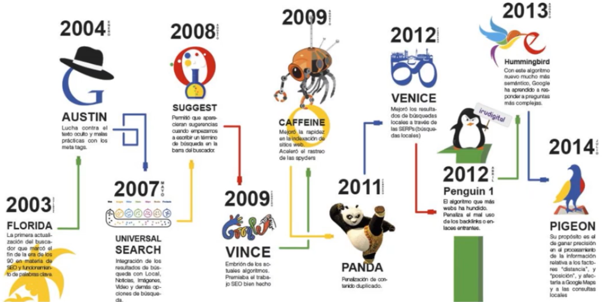
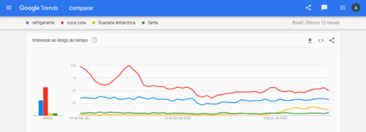
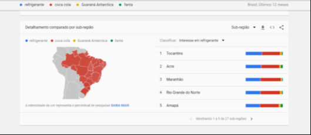
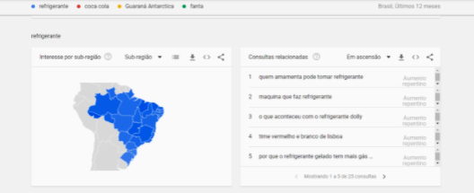

# Fundamentos do SEO

## Como funciona o Google
[Estatísticas de Pesquisas feitas no Google](https://www.internetlivestats.com/google-search-statistics/)

* O Google tem um robô, o googlebot
  * Ele rastreia a internet diariamente
  * Se o site não é atualizado com frequênca, o bot entende que não precisa passar por lá com frequência
* SERP (*Search Engine Results Page*)
  * São as páginas de respostas das buscas feitas pelos usuários
  * A ordem dos resultados são classificados por diversos fatores determinados pelo Google, nem todos são conhecidos
* Alguns fatores de classificação do Google
  * Fatores de domínio
  * Fatores no nível da página
  * Fatores em nível de site
  * Fatores de backlink
  * Interação com o usuário
  * Regras especiais de algoritmo do Google
  * Sinais de marca
  * Fatores de span no site
  * Fatores de spam fora do site
* Os algoritmos mudam com o tempo:

* As duas últimas atualizações recentes de algoritmos foram o Google Bert (2019) e o Core Update (2020)
  * Nelas, o fatore cada vez mais priorizado é o conteúdo do site. Quanto melhor for trabalhado o conteúdo, melhor será o posicionamento na SERP

## Como os usários buscam
* Google Search Insight
  * A barra de busca do google dá sugestões com grande volume de pesquisas
* Google Ads
  * Possui um ferramente planejadora de palavras chaves
* Momentos de buscas dos usuários
  * Busca informacional
    * Usuários buscando termos considerados Topo de Funil
    * Eles não sabem como resolver suas dores
    * Eles estão perdidos e sem informações
    * Estão em busca de conteúdos que os ajudem a solucionar os seus problemas
  * Busca navegacional
    * Usuários que estão no Meio do Funil
    * Eles sabem como querem resolver suas dores e sempre da melhor forma possível
    * Esse usuário se encontra em estado de aprendizagem
    * Procuram conteúdos que não sejam genéricos
  * Busca transacional
    * Usuário que já sabe exatamente o que deseja
    * O seu estado é o da decisão
    * Sabem quais são as principais soluções para suas dores
    * Fovo em conteúdo mais aprofundado para a tomada de decisão

## Ferramente de palavra chave
* [Google Trends](https://trends.google.com.br)
  * Ferramenta de comparação de volume de pesquisa entre palavras chave

## Fatos adicionais
* **Fonte:** [99 firms](https://99firms.com/blog/seo-statistics/)
  * 93% das experiências on-line começam com um mecanismo de pesquisa;
  * 75% dos usuários nem passam pela primeira página dos SERPs;
  * 50% das consultas de pesquisa consistem em pelo menos 4 palavras;
  * 21% dos usuários acessam mais de um dos resultados da pesquisa;
  * Os mecanismos de pesquisa direcionam 10 vezes mais tráfego para sites de compras do que as mídias sociais;
  * Estatísticas fascinantes da página do Google: 44% do tráfego de referência do site passa pelo Google;
  * Os resultados orgânicos do Google com 3-4 palavras no título aumentam a CTR;
  * O tempo de carregamento ideal em dispositivos móveis é de 5 segundos ou menos.

* [200 fatores de ranqueamento do google](https://backlinko.com/google-ranking-factors)

## Diagnóstico de SEO
### Autoridade
  * A autoridade é avaliada pelo Google, tembém, por meio do número de sites que apontam link para o seu site
    * O ideal é que seu site receba link de sites que tratam do mesmo assunto, e não de assuntos muito diferentes
  * Melhorar autoridade
    * Desenvolver um bom relacionamento com sites externos por meio de links
    * Quanto melhor for a autoridade de página que está referenciando sua página melhor
    * Uma página com muitos links, pouca autoridade será passada para cada link
    * Links contextuais e links de conteúdo são mais relevantes que links de menus e rodapés
    * Backlink (link de retorno) é quando conseguimos que alguns sites apontem link para o nosso site

### Velocidade
* Site rápido = bom ranqueamento
* O ideal é que os sites carreguem em menos de 2.5 segundos (4G)
* Tentar equilibrio entre bom design / Layout e site leve e de fácil carregamentgo
* Ferramentas para teste de tempo de carregamento de site
  * [Test my site](https://www.thinkwithgoogle.com/feature/testmysite/)
  * [Page speed insights](https://developers.google.com/speed/pagespeed/insights/)
* Com as mudanças nos algorítmos, o tempo de carregamento no site se tornou um fator importante

### Conteúdo para SEO
* Bom conteúdo (textos bem escritos)
  * Boa indexção no google
  * Mantém os usuários mais tempo navegando e lendo
* Perguntas típicas que clientes fazem durante uma navegação e compra
  * Qual o material desse produto?
  * Esse produto é bom?
  * Qual a opinião de quem já usou?
  * Você tem comentários de clientes em redes sociais? Coloque uma imagem do comentário lá
  * Esse produto resolve determinado problema?
  * Que tipo de pessoa usa esse produto?
  * Qual a garantia? Como é o pagamento?
  * Como é a entrega? E como é para trocar?
  * Quemé o site? Quem é a marca?

### Configurações básicas e mínimas de SEO
* Google Search Console
  * Mostra dados referentes às buscas que o seu site apareceu/aparece
  * Não mostra os dados dos seu concorrentes e nem revela os seus
  * Ótima ferramenta de acompanhamento e otimização grátis
* Extensão do Chrome

## Análise Competitiva
### Avaliando a concorrência
* Testar a concorrência é fundamental
* Observar quem são os principais concorrentes
* Fazer uma análise de como eles estão fazendo SEO em seus sites
* Existem ferramentas gratuitas de diagnóstico que podem ser usadas para comparar a velocidade do site e avaliar autoridade e outras pontuações do seu site e do site de seu concorrente
  * Plugin de SEO do Google Chrome
  * Ubersuggest (Neil Patel)
* Avaliar a autoridade da concorrência
* Avaliar o tráfego orgânico
  * Quantos sites apontam links para o concorrente?

## SEO On Page
* Estrutura das páginas, códigos e conteúdo
* Fatores On Page primordiais
  * Palavras-chave mais relevantes presentes na Tag `<title>`
  * Cada página deve possuir um título `<title>` próprio, relevante e diferente das outras páginas. **Proibido** títulos duplicados
  * Ordem da palavra-chave no `<title>`. A palavra-chave deve estar no início
  * Imagens com o atributo *alt* preenchidas e descrição correta da imagem
  * Verificar se o conteúdo do site é duplicado. Evitar copiar conteúdo de outros sites. O conteúdo deve ser único
  * Sem erros de ortografia e concordância no conteúdo
  * Uso de linkagem interna entre as páginas e também posts do site, seguindo as recomendações do texto âncora

## SEO Off Page
* Trabalho realizado para otimização de buscas fora da página
* É um processo competitivo, não é uma operação eventual
* Ganhar links de sites confiáveis com o Texto âncora deles sendo sua palavra-chave
* Evitar o uso de informações irrelevantes como link (Clique Aqui, Veja Aqui, Saiba Mais)
* Ganhar uma grande quantidade e qualidade de links externos
* Diversidade de domínios que “linkam” seu site
* Confiabilidade do domínio baseado nos links de sites importantes que recebe
* Bounce rate das páginas – Índice de entradas e saídas de cada página para uma palavra-chave.

## Métricas e KPIs básicos de SEO
### KPIs de tráfego
* Aumento do tráfego orgânico
* Aumento do número de páginas que geram tráfego considerável para o site
* Aumento do tráfego proveniente de páginas não relacionadas à marca da empresa
* Dois números que seguimos no Google Search Console são:
  * Número total de impressões orgânicas
  * Aumento no CTR das minhas páginas no buscador

### KPIs de geração de leads
* Porcentagem de visitantes convertidos em leads
* Porcentagem de novas assinaturas de newsletter
* Total de leads geradas através do blog

### KPIs de branded keywords
* As branded keywords nada mais são que as palavras-chave que estão diretamente ligadas à identidade do seu negócio
* No caso do nosso curso, seriam o nome da empresa (Digital Marketing Cube) e a forma como ela presta serviço (Consultoria em Marketing Digital)
* Então, quando pensamos em palavras-chave branded, os KPIs que você deve ficar de olho são:
  * Aumento do tráfego proveniente de branded keywords
  * Aumento no número de menções de branded keywords
  * Principalmente o último número, as menções de palavras-chave do nosso negócio, são de extrema importância

### KPIs de Link Building
* Número total de Links conquistados
* Número de Links de sites de autoridade
* Número de Links obtidos provenientes de sites relevantes

### KPIs que CMO e CEO adoram:
* Quanta receita foi gerada graças ao tráfego orgânico: Descubra quantos clientes foram gerados que são provenientes de acessos orgânicos
* Se o custo de aquisição de clientes (CAC) caiu: Faça uma comparação do custo de aquisição de todos os canais da sua empresa. Caso sua estratégia de SEO esteja dando resultados positivos, você pode ter certeza que este número será interessante para seus superiores
* ROI de sua estratégia em SEO: Básico do básico, a comprovação de que todo o investimento realizado em sua estratégia de SEO está valendo a pena
* Economia em Adwords: faça um cálculo para descobrir quanto seria necessário investir em adwords para obter o mesmo tráfego caso estivéssemos investindo em mídia paga. Tráfego orgânico = Custo zero
* Cuidado com as métricas e KPIs da vaidade. Aqueles que todo mundo se empolga, mas nao representam nada de realmente positivo para o seu projeto de SEO

### Como montar uma apresentação com os resultados de SEO?
* Visão Geral do tráfego
* Tráfego de Visitas Orgânicas
* Comparativos mês atual x mês anterior
* Comparativos mês atual ano atual x mesmo mês mas ano anterior
* Conversões por tráfego de pesquisa orgânica
* Top 10 Páginas Visitadas
* Porcentagem de tráfego por canais
* Posicionamento de Palavras-chave estratégicas